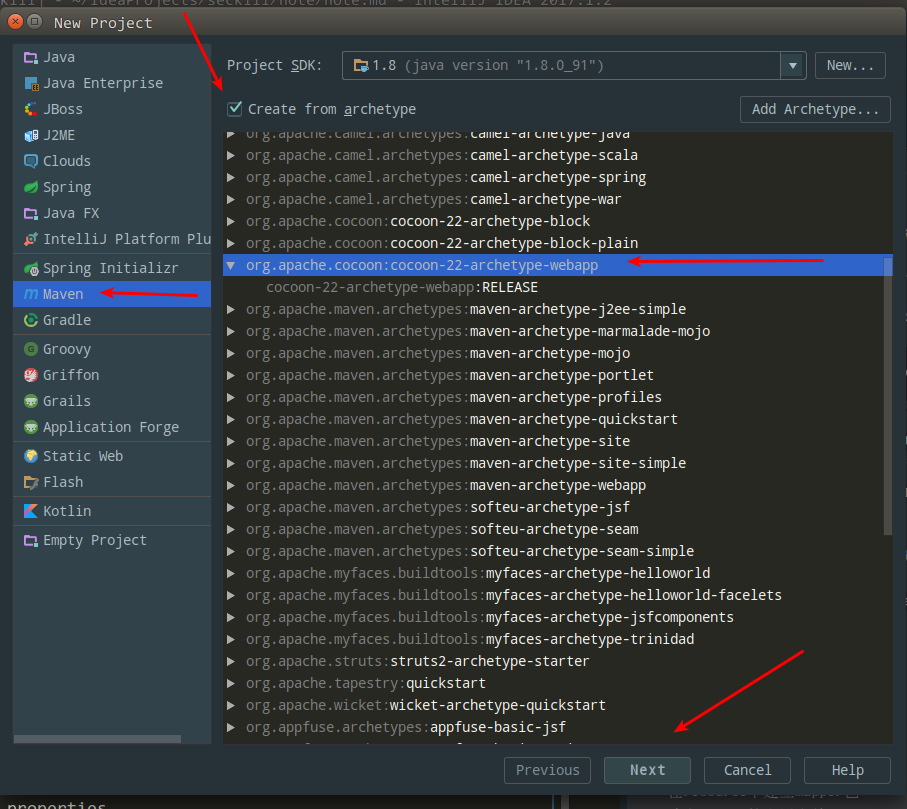
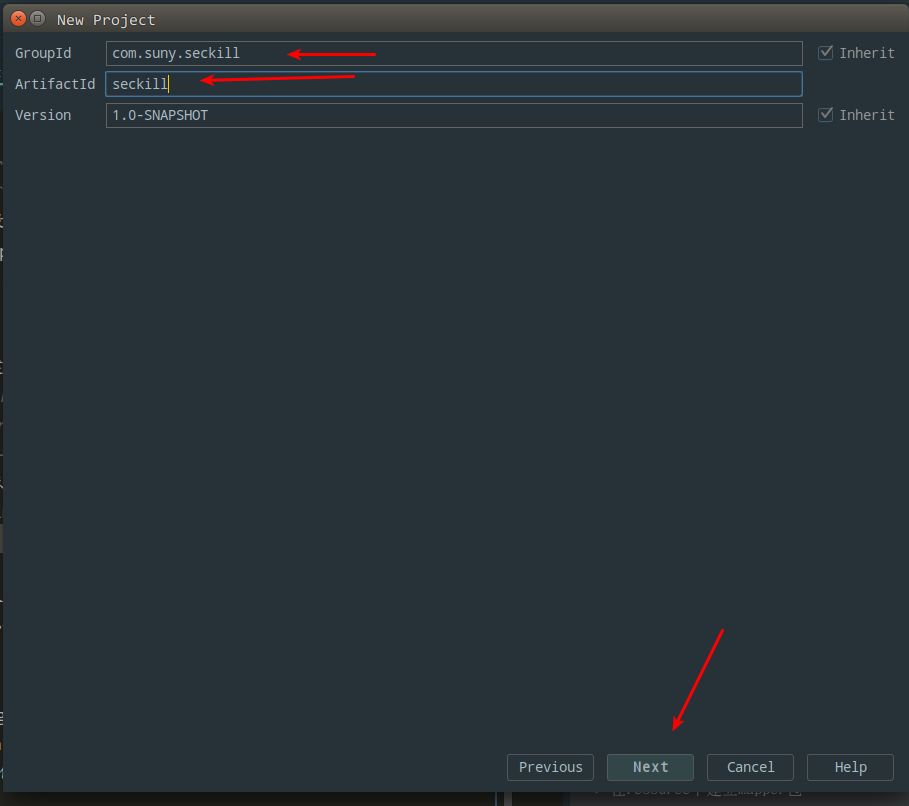
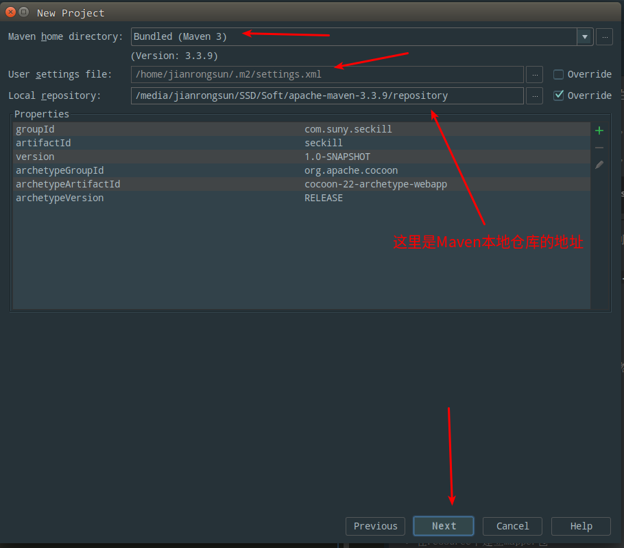
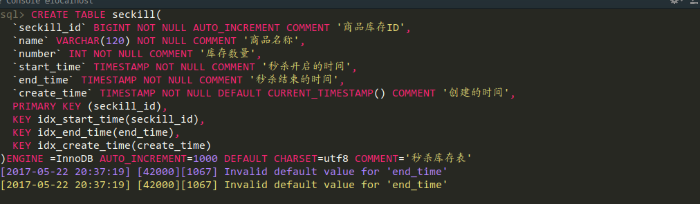
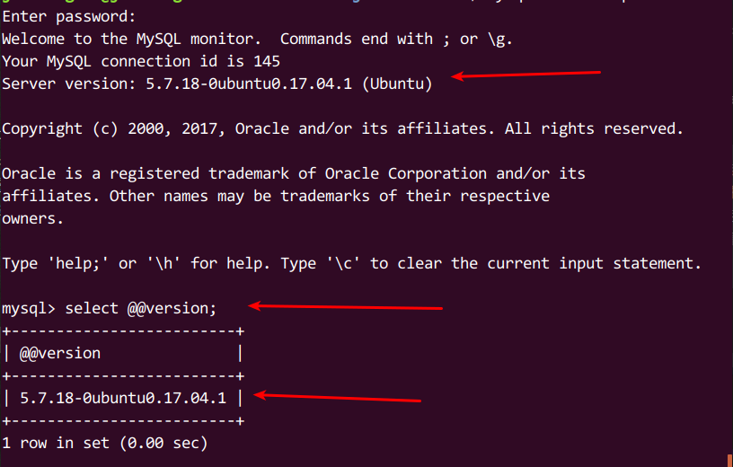
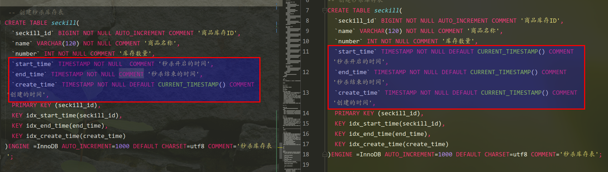
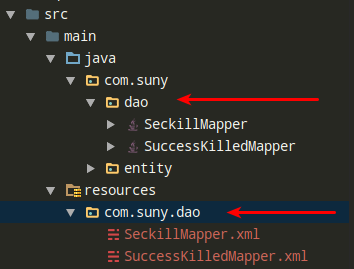

# seckill
一个整合SSM框架的高并发和商品秒杀项目,学习目前较流行的Java框架组合实现高并发秒杀API

## 项目的来源
项目的来源于国内IT公开课平台[慕课网](http://www.imooc.com),慕课网上资源有质量没的说,很适合学习一些技术的基础,这个项目是由四个系列的课程组成的,流程分为几个流程,很基础地教你接触到一个相对有技术含量的项目
 - Java高并发秒杀API之业务分析与DAO层
 - Java高并发秒杀API之web层
 - Java高并发秒杀API之Service层
 - Java高并发秒杀API之高并发优化

其实这几个流程也就是开发的流程,首先从DAO层开始开发,从后往前开发,开始Coding吧！

## 项目环境的搭建
* **操作系统** : Ubuntu 17.04 
* **IDE** ：IntelliJ IDEA 2016.2.5 x64 用Eclipse也一样的,工具时靠人用的
* **JDK** : JDK1.8 建议使用JDK1.7以上版本,有许多语法糖用着挺舒服的
* **Web容器** ： Tomcat 8.0 
* **数据库** ：Mysql-5.6.17-WinX64    实验性的项目用Mysql就足够啦
* **依赖管理工具** : Maven  管理jar包真的很方便  

  这里列出的环境不是必须的,你喜欢用什么就用什么,这里只是给出参考,不过不同的版本可能会引起各种不同的问题就需要我们自己去发现以及排查,在这里使用Maven的话时方便我们管理JAR包,我们不用跑去各种开源框架的官网去下载一个又一个的JAR包,配置好了Maven后添加pom文件坐标就会从中央仓库下载JAR包,如果哪天替换版本也很方便
---
## 项目效果图
 - 秒杀商品列表  
 
  

 - 秒杀结束提示界面  
 
  

 - 开始秒杀提示界面  
 
 
 
 - 重复秒杀提示界面  
 
  

 - 秒杀秒杀成功提示界面  
 
  

---
## 项目的运行
### 下载  

`Download Zip`或者 `git clone`
``` shell
	git clone https://github.com/Sunybyjava/seckill.git
```
### 导入到IDE  
这里因为是使用`IDEA`创建的项目,所以使用`IDEA`直接打开是很方便的,提前是你要配置好`maven`的相关配置,以及项目`JDK`版本,
`JDK`版本必须在`1.8`以上,因为在项目中使用了`Java8`的`LocalDateTime`以及`LocalDate`,所以低于这个版本编译会失败的
  - IDEA  
  直接在主界面选择`Open`,然后找到项目所在路径,点击导入就可以了
  - Eclipse
  这个项目是基于`IDEA`创建,我这里把项目转成了`Eclipse`的项目,如果你使用Eclipse的话也可以直接导入,只是步骤更繁琐一点,[Eclipse导入步骤](/note/EclipseImport.md)
  
  
## 项目编码 
项目总结可能比较的长,**密集恐惧症**者请按小节进行阅读  

- [(一)Java高并发秒杀API之业务分析与DAO层](/note/note1.md)
- [(二)Java高并发秒杀API之Service层](/note/note2.md)
- [(三)Java高并发秒杀API之web层](/note/note3.md)
- [(四)Java高并发秒杀API之高并发优化](/note/note4.md)  

这里按照上面几个流程走下去,你要有基本的Maven认识以及Java语法的一些概念,要不然可能不太理解
### (一)Java高并发秒杀APi之业务分析与DAO层代码编写
#### 构建项目的基本骨架
 * 首先我们要搭建出一个符合Maven约定的目录来,这里大致有两种方式,第一种:
1. 第一种使用命令行手动构建一个maven结构的目录,当然我基本不会这样构建
```
mvn archetype:generate -DgroupId=com.suny.seckill -DartifactId=seckill -Dpackage=com.suny.seckill -Dversion=1.0-SNAPSHOT -DarchetypeArtifactId=maven-archetype-webapp
```  
这里要注意的是使用`archetype:generate`进行创建,在Maven老版本中是使用`archetype:create`,现在这种方法已经被弃用了,所以使用命令行创建的话注意了,稍微解释下这段语句的意思,就是构建一个一个`maven-archetype-webapp`骨架的Webapp项目,然后`groupId`为`com.suny.seckill `,`artifactId`为`seckill`,这里是Maven相关知识,可以按照自己的情况进行修改  

2.第二种直接在IDE中进行创建,这里以IDEA为例
  + 点击左上角`File>New>Project>Maven`
  + 然后在里面勾选`Create from archetype`,然后再往下拉找到`org.apache.cocoon:cocoon-22-archetype-webapp`,选中它,注意要先勾选那个选项,否则选择不了,然后点击`Next`继续  
      
  +然后就填写你的Maven的那几个重要的坐标了,自己看着填吧  
    
  +再就配置你的Maven的相关信息,默认应该是配置好的  
    
  +之后就是点`Finsh`,到此不出意外的话就应该创建成功了    
  
#### 构建pom文件
  
  项目基本的骨架我们就创建出来了,接下来我们要添加一些基本的JAR包的依赖,也就是在`pom.xml`中添加各种开源组件的三坐标了    
  
  ```xml
<project xmlns="http://maven.apache.org/POM/4.0.0" xmlns:xsi="http://www.w3.org/2001/XMLSchema-instance"
         xsi:schemaLocation="http://maven.apache.org/POM/4.0.0 http://maven.apache.org/maven-v4_0_0.xsd">
          <modelVersion>4.0.0</modelVersion>
          <groupId>com.suny.seckill</groupId>
          <artifactId>seckill</artifactId>
          <version>1.0-SNAPSHOT</version>
          <name>seckill Maven Webapp</name>
          <url>http://maven.apache.org</url>
    <dependencies>

        <!--junit测试-->
        <dependency>
            <groupId>junit</groupId>
            <artifactId>junit</artifactId>
            <version>4.12</version>
            <scope>test</scope>
        </dependency>

        <!--配置日志相关,日志门面使用slf4j,日志的具体实现由logback实现-->
        <dependency>
            <groupId>ch.qos.logback</groupId>
            <artifactId>logback-classic</artifactId>
            <version>1.1.7</version>
        </dependency>
        <dependency>
            <groupId>org.slf4j</groupId>
            <artifactId>slf4j-api</artifactId>
            <version>1.7.21</version>
        </dependency>
        <dependency>
            <groupId>org.apache.logging.log4j</groupId>
            <artifactId>log4j-core</artifactId>
            <version>2.6.1</version>
        </dependency>

        <!--数据库相关依赖-->
        <!--首先导入连接Mysql数据连接-->
        <dependency>
            <groupId>mysql</groupId>
            <artifactId>mysql-connector-java</artifactId>
            <version>5.1.39</version>
        </dependency>

        <!--导入数据库连接池-->
        <dependency>
            <groupId>c3p0</groupId>
            <artifactId>c3p0</artifactId>
            <version>0.9.1.2</version>
        </dependency>

        <!--导入mybatis依赖-->
        <dependency>
            <groupId>org.mybatis</groupId>
            <artifactId>mybatis</artifactId>
            <version>3.4.2</version>
        </dependency>
        <dependency>
            <groupId>org.mybatis</groupId>
            <artifactId>mybatis-spring</artifactId>
            <version>1.3.1</version>
        </dependency>

        <!--导入Servlet web相关的依赖-->
        <dependency>
            <groupId>taglibs</groupId>
            <artifactId>standard</artifactId>
            <version>1.1.2</version>
        </dependency>
        <dependency>
            <groupId>jstl</groupId>
            <artifactId>jstl</artifactId>
            <version>1.2</version>
        </dependency>
        <!--spring默认的json转换-->
        <dependency>
            <groupId>com.fasterxml.jackson.core</groupId>
            <artifactId>jackson-databind</artifactId>
            <version>2.8.5</version>
        </dependency>
        <dependency>
            <groupId>javax.servlet</groupId>
            <artifactId>javax.servlet-api</artifactId>
            <version>3.1.0</version>
        </dependency>
        
        <!--导入spring相关依赖-->
        <dependency>
            <groupId>org.springframework</groupId>
            <artifactId>spring-core</artifactId>
            <version>4.3.6.RELEASE</version>
        </dependency>
        <dependency>
            <groupId>org.springframework</groupId>
            <artifactId>spring-beans</artifactId>
            <version>4.3.6.RELEASE</version>
        </dependency>
        <dependency>
            <groupId>org.springframework</groupId>
            <artifactId>spring-context</artifactId>
            <version>4.3.6.RELEASE</version>
        </dependency>
        <dependency>
            <groupId>org.springframework</groupId>
            <artifactId>spring-jdbc</artifactId>
            <version>4.3.7.RELEASE</version>
        </dependency>
        <dependency>
            <groupId>org.springframework</groupId>
            <artifactId>spring-tx</artifactId>
            <version>4.3.6.RELEASE</version>
        </dependency>
        <dependency>
            <groupId>org.springframework</groupId>
            <artifactId>spring-web</artifactId>
            <version>4.3.6.RELEASE</version>
        </dependency>
        <dependency>
            <groupId>org.springframework</groupId>
            <artifactId>spring-webmvc</artifactId>
            <version>4.3.7.RELEASE</version>
        </dependency>
        
        <!--导入springTest-->
        <dependency>
            <groupId>org.springframework</groupId>
            <artifactId>spring-test</artifactId>
            <version>4.2.7.RELEASE</version>
        </dependency>
    </dependencies>
    <build>
        <finalName>seckill</finalName>
    </build>
</project>

  ```
#### 建立数据库
在根目录下有一个[sql](sql)文件夹里面有一个[sql数据库脚本](sql/seckill.sql),如果你不想自己手写的话就直接导入到你的数据库里面去吧,不过还是建议自己手写一遍加深印象

```sql

-- 整个项目的数据库脚本
-- 开始创建一个数据库
CREATE DATABASE seckill;
-- 使用数据库
USE seckill;
-- 创建秒杀库存表
CREATE TABLE seckill(
  `seckill_id` BIGINT NOT NULL AUTO_INCREMENT COMMENT '商品库存ID',
  `name` VARCHAR(120) NOT NULL COMMENT '商品名称',
  `number` INT NOT NULL COMMENT '库存数量',
  `start_time` TIMESTAMP NOT NULL DEFAULT CURRENT_TIMESTAMP() COMMENT '秒杀开启的时间',
  `end_time` TIMESTAMP NOT NULL DEFAULT CURRENT_TIMESTAMP() COMMENT '秒杀结束的时间',
  `create_time` TIMESTAMP NOT NULL DEFAULT CURRENT_TIMESTAMP() COMMENT '创建的时间',
  PRIMARY KEY (seckill_id),
  KEY idx_start_time(seckill_id),
  KEY idx_end_time(end_time),
  KEY idx_create_time(create_time)
)ENGINE =InnoDB AUTO_INCREMENT=1000 DEFAULT CHARSET=utf8 COMMENT='秒杀库存表';

-- 插入初始化数据

insert into
  seckill(name,number,start_time,end_time)
values
  ('1000元秒杀iphone6',100,'2016-5-22 00:00:00','2016-5-23 00:00:00'),
  ('500元秒杀iPad2',200,'2016-5-22 00:00:00','2016-5-23 00:00:00'),
  ('300元秒杀小米4',300,'2016-5-22 00:00:00','2016-5-23 00:00:00'),
  ('200元秒杀红米note',400,'2016-5-22 00:00:00','2016-5-23 00:00:00');

-- 秒杀成功明细表
-- 用户登录相关信息
create table success_killed(
  `seckill_id` BIGINT NOT NULL COMMENT '秒杀商品ID',
  `user_phone` BIGINT NOT NULL COMMENT '用户手机号',
  `state` TINYINT NOT NULL DEFAULT -1 COMMENT '状态标示:-1无效 0成功 1已付款',
  `create_time` TIMESTAMP NOT NULL COMMENT '创建时间',
  PRIMARY KEY (seckill_id,user_phone), /*联合主键*/
  KEY idx_create_time(create_time)
)ENGINE =InnDB DEFAULT CHARSET =utf8 COMMENT ='秒杀成功明细表'

```
 + 在建立数据库的,如果按照我这里的数据库脚本建立的话应该是没问题的,但是我按照视频里面的数据库脚本建表的话发生了一个错误  
  
 这个报错看起来比较的诡异,我仔细检查`sql`也没有错误,它总提示我`end_time`要有一个默认的值,可我记得我以前就不会这样,然后视频里面也没有执行错误,然后我感觉可能时`MySQL`版本的差异,我查看了下我数据库版本,在登录`Mysql`控制台后输入指令,在控制台的我暂时知道的有两种方式:
 ```sql
select version();  
select @@version;
```
我的输出结果如下:

其实登录进控制台就已经可以看到版本了,我的Mysql是`5.7`的,以前我用的时`5.6`的,然后去`Google`上搜索了下,找到了几个答案,参考链接：  
  - [Invalid default value for 'create_date' timestamp field
](https://stackoverflow.com/questions/9192027/invalid-default-value-for-create-date-timestamp-field)  
 - [mysql官方的解释](https://dev.mysql.com/doc/refman/5.7/en/sql-mode.html#sqlmode_no_zero_date)  
 - [MySQL Community 5.7 - Invalid default value (datetime field type)
](https://stackoverflow.com/questions/34570611/mysql-community-5-7-invalid-default-value-datetime-field-type)  
总结出来一句话就是:
> mysql 5.7中,默认使用的是严格模式,这里的日期必须要有时间,所以一定要给出默认值,要么就修改数据库设置  

然后网友评论里总结出来的几种解决办法,未经测试！：  
 + 下次有问题一定要先看一下评论！！！create不了的同学,可以这样写：
 ```sql
    `start_time` TIMESTAMP NOT NULL DEFAULT CURRENT_TIMESTAMP COMMENT '秒杀开始时间',
    `end_time` TIMESTAMP NOT NULL DEFAULT CURRENT_TIMESTAMP COMMENT '秒杀结束时间',
    `create_time` TIMESTAMP NOT NULL DEFAULT CURRENT_TIMESTAMP COMMENT '创建时间',
 ```
    
   + 关于timestamp的问题,需要先运行 set explicit_defaults_for_timestamp = 1,否则会报invalid default value错误
   + 还需要注意的是SQL版本的问题会导致视频中seckill表创建会出错。只要将create_time放在start_time和end_time之前是方便的解决方法。  

 对比下我修改过后的跟视频里面的`sql`片段:
   
 我们可以看到在这三个字段有一个小差别,那就是给`start_time`,`end_time`,`create_time`三个字段都添加一个默认值,然后执行数据库语句就没问题了
 
---
####  这里我们需要修改下`web.xml`中的servlet版本为`3.0`
打开`WEB-INF`下的`web.xml`,修改为以下代码:
```xml
<web-app xmlns="http://java.sun.com/xml/ns/javaee"
         xmlns:xsi="http://www.w3.org/2001/XMLSchema-instance"
         xsi:schemaLocation="http://java.sun.com/xml/ns/javaee
                      http://java.sun.com/xml/ns/javaee/web-app_3_0.xsd"
         version="3.0"
         metadata-complete="true">
    <!--用maven创建的web-app需要修改servlet的版本为3.0-->
```
修改的原因有以下几点:  
   * 高版本的Servlet支持更多的特性,更方便我们的Coding,特别是支持注解这一特性
   * 在`Servlet2.3`中新加入了`Listener`接口的实现,,我们可以使用`Listener`引入`Spring`的`ContextLoaderListener`  

举个栗子:  
  + 在`Servlet2.3`以前我们这样配置`ContextLoaderListener`:
```xml
<servlet>
 <servlet-name>context</servlet-name>
 <servlet-class>org.springframework.context.ContextLoaderServlet</servlet-class>
 <load-on-startup>1</load-on-startup>
</servlet>
```
 + 在`Servlet2.3`以后可以使用`Listener`配置,也就是我们项目中使用的方法
 ````xml
<listener>
 <listener-class>org.springframework.context.ContextLoaderListener</listener-class>
</listener>
````
两种方法的效果都是一样的,主要不要同时使用,否则会报错的  


#### 建立实体类
 - 首先建立`SuccessKilled`  秒杀状态表
```java
package com.suny.entity;

import java.io.Serializable;
import java.time.LocalDateTime;


public class SuccessKilled implements Serializable {
    private static final long serialVersionUID = 1834437127882846202L;

    private long seckillId;
    /* 用户的手机号码*/
    private long userPhone;
    /* 秒杀的状态*/
    private short state;
    /* 创建时间*/
    private LocalDateTime createTime;
    /* 多对一,因为一件商品在库存中肯定有许多,对应的购买信息也有很多*/
    private Seckill seckill;

    public SuccessKilled() {
    }

    public SuccessKilled(long seckillId, long userPhone, short state, LocalDateTime createTime, Seckill seckill) {
        this.seckillId = seckillId;
        this.userPhone = userPhone;
        this.state = state;
        this.createTime = createTime;
        this.seckill = seckill;
    }

    public long getSeckillId() {
        return seckillId;
    }

    public void setSeckillId(long seckillId) {
        this.seckillId = seckillId;
    }

    public long getUserPhone() {
        return userPhone;
    }

    public void setUserPhone(long userPhone) {
        this.userPhone = userPhone;
    }

    public short getState() {
        return state;
    }

    public void setState(short state) {
        this.state = state;
    }

    public LocalDateTime getCreateTime() {
        return createTime;
    }

    public void setCreateTime(LocalDateTime createTime) {
        this.createTime = createTime;
    }

    public Seckill getSeckill() {
        return seckill;
    }

    public void setSeckill(Seckill seckill) {
        this.seckill = seckill;
    }

    @Override
    public String toString() {
        return "SuccessKilled{" +
                "主键ID=" + seckillId +
                ", 手机号码=" + userPhone +
                ", 秒杀状态=" + state +
                ", 创建时间=" + createTime +
                ", 秒杀的商品=" + seckill +
                '}';
    }
}


```
 - 再建立`Seckill` 秒杀商品信息
```java
package com.suny.entity;

import java.io.Serializable;
import java.time.LocalDateTime;

public class Seckill implements Serializable {

    private static final long serialVersionUID = 2912164127598660137L;
    /* 主键ID*/
    private long seckillId;
    /*  秒杀商品名字 */
    private String name;
    /* 秒杀的商品编号 */
    private int number;
    /* 开始秒杀的时间 */
    private LocalDateTime startTime;
    /* 结束秒杀的时间 */
    private LocalDateTime endTime;
    /* 创建的时间 */
    private LocalDateTime createTIme;

    public Seckill() {
    }

    public Seckill(long seckillId, String name, int number, LocalDateTime startTime, LocalDateTime endTime, LocalDateTime createTIme) {
        this.seckillId = seckillId;
        this.name = name;
        this.number = number;
        this.startTime = startTime;
        this.endTime = endTime;
        this.createTIme = createTIme;
    }

    public long getSeckillId() {
        return seckillId;
    }

    public void setSeckillId(long seckillId) {
        this.seckillId = seckillId;
    }

    public String getName() {
        return name;
    }

    public void setName(String name) {
        this.name = name;
    }

    public int getNumber() {
        return number;
    }

    public void setNumber(int number) {
        this.number = number;
    }

    public LocalDateTime getStartTime() {
        return startTime;
    }

    public void setStartTime(LocalDateTime startTime) {
        this.startTime = startTime;
    }

    public LocalDateTime getEndTime() {
        return endTime;
    }

    public void setEndTime(LocalDateTime endTime) {
        this.endTime = endTime;
    }

    public LocalDateTime getCreateTIme() {
        return createTIme;
    }

    public void setCreateTIme(LocalDateTime createTIme) {
        this.createTIme = createTIme;
    }

    @Override
    public String toString() {
        return "com.suny.entity.Seckill{" +
                "主键ID=" + seckillId +
                ", 秒杀商品='" + name + '\'' +
                ", 编号=" + number +
                ", 开始秒杀时间=" + startTime +
                ", 结束秒杀时间=" + endTime +
                ", 创建时间=" + createTIme +
                '}';
    }
}


```
 #### 对实体类创建对应的`mapper`接口,也就是`dao`接口类
 - 首先创建`SeckillMapper`,在我这里位于`com.suny.dao`包下
 ```java
package com.suny.dao;

import com.suny.entity.Seckill;
import org.apache.ibatis.annotations.Param;

import java.time.LocalDateTime;
import java.util.List;

public interface SeckillMapper {
    /**
     * 根据传过来的<code>seckillId</code>去减少商品的库存.
     *
     * @param seckillId 秒杀商品ID
     * @param killTime  秒杀的精确时间
     * @return 如果秒杀成功就返回1,否则就返回0
     */
    int reduceNumber(@Param("seckillId") long seckillId, @Param("killTime") LocalDateTime killTime);

    /**
     * 根据传过来的<code>seckillId</code>去查询秒杀商品的详情.
     *
     * @param seckillId 秒杀商品ID
     * @return 对应商品ID的的数据
     */
    Seckill queryById(@Param("seckillId") long seckillId);

    /**
     * 根据一个偏移量去查询秒杀的商品列表.
     *
     * @param offset 偏移量
     * @param limit  限制查询的数据个数
     * @return 符合偏移量查出来的数据个数
     */
    List<Seckill> queryAll(@Param("offset") int offset, @Param("limit") int limit);
}

```
 - 再创建`SuccessKilledMapper`
 ```java
package com.suny.dao;

import com.suny.entity.SuccessKilled;
import org.apache.ibatis.annotations.Param;


public interface SuccessKilledMapper {
    /**
     * 插入一条详细的购买信息.
     *
     * @param seckillId 秒杀商品的ID
     * @param userPhone 购买用户的手机号码
     * @return 成功插入就返回1, 否则就返回0
     */
    int insertSuccessKilled(@Param("seckillId") long seckillId, @Param("userPhone") long userPhone);

    /**
     * 根据秒杀商品的ID查询<code>SuccessKilled</code>的明细信息.
     *
     * @param seckillId 秒杀商品的ID
     * @param userPhone 购买用户的手机号码
     * @return 秒杀商品的明细信息
     */
    SuccessKilled queryByIdWithSeckill(@Param("seckillId") long seckillId, @Param("userPhone") long userPhone);
}

```
#### 接下来书写`xml`配置文件
##### 建立对应的`mapper.xml`  

首先在`src/main/resources`建立`com.suny.dao`这个包,也就是对应`mapper`接口文件包一样的包名,这样符合Maven的约定,就是资源放置在`Resource`包下,`Java`包下则是放置`java`类文件,编译后最后还是会在同一个目录下.  

- 首先建立`SeckillMapper.xml`
```xml
<!DOCTYPE mapper
        PUBLIC "-//mybatis.org//DTD Mapper 3.0//EN"
        "http://mybatis.org/dtd/mybatis-3-mapper.dtd">
<mapper namespace="com.suny.dao.SeckillMapper">
    <!--这里的<=需要使用进行忽略,所以是要进行忽略,使用CDATA 区段中的文本会被解析器忽略 -->
    <update id="reduceNumber">
        UPDATE seckill
        SET number = number - 1
        WHERE seckill_id = #{seckillId}
              AND start_time 
              <![CDATA[
              <=
              ]]>
         #{killTime}
              AND end_time >= #{killTime}
              AND number > 0
    </update>

    <select id="queryById" resultType="com.suny.entity.Seckill">
        SELECT
            *
        FROM seckill AS s
        WHERE s.seckill_id = #{seckillId}
    </select>


    <select id="queryAll" resultType="com.suny.entity.Seckill">
        SELECT
            *
        FROM seckill AS s
        ORDER BY create_time DESC
        LIMIT #{offset}, #{limit}
    </select>
</mapper>
```
- 建立`SuccessKilledMapper.xml`
```xml

<!DOCTYPE mapper
        PUBLIC "-//mybatis.org//DTD Mapper 3.0//EN"
        "http://mybatis.org/dtd/mybatis-3-mapper.dtd">
<mapper namespace="com.suny.dao.SuccessKilledMapper">
    <!--添加主键冲突时忽略错误返回0-->  
    <insert id="insertSuccessKilled">
        INSERT IGNORE INTO success_killed (seckill_id, user_phone, state)
        VALUES (#{seckillId}, #{userPhone}, 0)
    </insert>
    <!--根据seckillId查询SuccessKilled对象,并携带Seckill对象,告诉mybatis把映射结果映射到SuccessKill属性同时映射到Seckill属性-->  
    <select id="queryByIdWithSeckill" resultType="com.suny.entity.SuccessKilled">
        SELECT
            sk.seckill_id,
            sk.user_phone,
            sk.create_time,
            sk.state,
            s.seckill_id  "seckill.seckill_id",
            s.name "seckill.name",
            s.number "seckill",
            s.start_time  "seckill.start_time",
            s.end_time  "seckill.end_time",
            s.create_time "seckill.create_time"
        FROM success_killed sk
            INNER JOIN seckill s ON sk.seckill_id = s.seckill_id
        WHERE sk.seckill_id = #{seckillId}
              AND sk.user_phone= #{userPhone}
    </select>

</mapper>  
  
```
- 建立`Mybatis`的配置文件`mybatis-config.xml`
```xml
<?xml version="1.0" encoding="UTF-8" ?>
<!DOCTYPE configuration PUBLIC
        "-//mybatis.org//DTD MyBatis Generator Configuration 3.0//EN"
        "http://mybatis.org/dtd/mybatis-3-config.dtd" >
<configuration>
    <!--首先配置全局属性-->
    <settings>
        <!--开启自动填充主键功能,原理时通过jdbc的一个方法getGeneratekeys获取自增主键值-->
        <setting name="useGeneratedKeys" value="true"/>
        <!--使用别名替换列名,默认就是开启的-->
        <setting name="useColumnLabel" value="true"/>
        <!--开启驼峰命名的转换-->
        <setting name="mapUnderscoreToCamelCase" value="true"/>
    </settings>
</configuration>
```
- 然后建立连接数据库的配置文件`jdbc.properties`,这里的属性要根据自己的需要去进行修改,切勿直接复制使用  
```properties
jdbc.driver=com.mysql.jdbc.Driver
jdbc.user=root
jdbc.password=root
jdbc.url=jdbc:mysql://localhost:3306/seckill?useUnicode=true&characterEncoding=utf-8
```
- 建立`Spring`的`dao`的配置文件,在`resources`包下创建`applicationContext-dao.xml`
```xml

<?xml version="1.0" encoding="UTF-8"?>
<!--suppress SpringFacetInspection -->
<beans xmlns="http://www.springframework.org/schema/beans"
       xmlns:xsi="http://www.w3.org/2001/XMLSchema-instance"
       xmlns:context="http://www.springframework.org/schema/context"
       xmlns:tx="http://www.springframework.org/schema/tx"
       xsi:schemaLocation="http://www.springframework.org/schema/beans http://www.springframework.org/schema/beans/spring-beans-4.3.xsd
		http://www.springframework.org/schema/context http://www.springframework.org/schema/context/spring-context-4.3.xsd">
    <context:property-placeholder location="classpath:jdbc.properties"/>

    <!--配置数据库连接池-->
    <bean id="dataSource" class="com.mchange.v2.c3p0.ComboPooledDataSource">
        <!--配置基本的数据库连接-->
        <property name="driverClass" value="${jdbc.driver}"/>
        <property name="jdbcUrl" value="${jdbc.url}"/>
        <property name="user" value="${jdbc.user}"/>
        <property name="password" value="${jdbc.password}"/>
        <!--c3p0私有属性-->
        <property name="maxPoolSize" value="30"/>
        <property name="minPoolSize" value="10"/>
        <!--关闭连接后不自动commit-->
        <property name="autoCommitOnClose" value="false"/>
        <!--获取连接超时时间-->
        <property name="checkoutTimeout" value="1000"/>
        <!--当获取连接失败时的重试次数-->
    </bean>
    <!--配置sqlSessionFactory对象-->
    <bean id="sqlSessionFactory" class="org.mybatis.spring.SqlSessionFactoryBean">
        <!--注入数据库连接池-->
        <property name="dataSource" ref="dataSource"/>
        <!--配置mybatis全局配置文件-->
        <property name="configLocation" value="mybatis-config.xml"/>
        <!--配置entity包,也就是实体类包,自动扫描,用于别名配置-->
        <property name="typeAliasesPackage" value="com.suny.entity"/>
        <!--配置需要扫描的mapper.xml文件-->
        <property name="mapperLocations" value="classpath*:com/suny/dao/*.xml"/>
    </bean>

    <!--配置mapper接口包,动态实现mapper接口,注入到Spring容器-->
    <bean class="org.mybatis.spring.mapper.MapperScannerConfigurer">
        <!--注入sqlSessionFactory,请注意不要使用sqlSessionFactoryBean,否则会出现注入异常-->
        <property name="sqlSessionFactoryBeanName" value="sqlSessionFactory"/>
        <!--给出要扫描的mapper接口-->
        <property name="basePackage" value="com.suny.dao"/>
    </bean>

</beans>

```

- 基础的部分我们搭建完成了,然后要开始测试了
 在`IDEA`里面有一个快速建立测试的快捷键`Ctrl+Shift+T`,在某个要测试的类里面按下这个快捷键就会出现`Create new Test`,然后选择你要测试的方法跟测试的工具就可以了,这里我们使用Junit作为测试
  + 建立`SeckillMapperTest`文件,代码如下
 ```java
package com.suny.dao;

import com.suny.entity.Seckill;
import org.junit.Test;
import org.junit.runner.RunWith;
import org.springframework.test.context.ContextConfiguration;
import org.springframework.test.context.junit4.SpringJUnit4ClassRunner;

import javax.annotation.Resource;

import java.time.LocalDateTime;
import java.util.List;

import static org.junit.Assert.*;


@RunWith(SpringJUnit4ClassRunner.class)
@ContextConfiguration({"classpath:spring/applicationContext-dao.xml"})
public class SeckillMapperTest {
    @Resource
    private SeckillMapper seckillMapper;

    @Test
    public void reduceNumber() throws Exception {
        long seckillId=1000;
        LocalDateTime localDateTime=LocalDateTime.now();
        int i = seckillMapper.reduceNumber(seckillId, localDateTime);
        System.out.println(i);
    }

    @Test
    public void queryById() throws Exception {
        long seckillId = 1000;
        Seckill seckill = seckillMapper.queryById(seckillId);
        System.out.println(seckill.toString());
    }

    @Test
    public void queryAll() throws Exception {
        List<Seckill> seckills = seckillMapper.queryAll(0, 100);
        for (Seckill seckill : seckills) {
            System.out.println(seckill.toString());
        }
    }

}
```
测试中可能会出现`Mybatis`参数绑定失败的错误,在`mapper`接口中的方法里面添加`@Param`的注解,显示的告诉mybatis参数的名称是什么,例如
```java
 List<Seckill> queryAll(@Param("offset") int offset, @Param("limit") int limit);

```  
#### 2016-5-23 13:46：28

---   

### (二)Java高并发秒杀API之Service层 
 首先在编写`Service`层代码前,我们应该首先要知道这一层到底时干什么的,这里摘取来自`ITEYE`一位博主的原话
 > Service层主要负责业务模块的逻辑应用设计。同样是首先设计接口,再设计其实现的类,接着再Spring的配置文件中配置其实现的关联。这样我们就可以在应用中调用Service接口来进行业务处理。Service层的业务实现,具体要调用到已定义的DAO层的接口,封装Service层的业务逻辑有利于通用的业务逻辑的独立性和重复利用性,程序显得非常简洁。  
 
 在项目中要降低耦合的话,分层是一种很好的概念,就是各层各司其职,尽量不做不相干的事,所以`Service`层的话顾名思义就是**业务逻辑**,处理程序中的一些业务逻辑,以及调用`DAO`层的代码,这里我们的`DAo`层就是连接数据库的那一层,调用关系可以这样表达:  
   View(页面)>Controller(控制层)>Service(业务逻辑)>Dao(数据访问)>Database(数据库)  
   + 首先还是接口的设计,设计Service秒杀商品的接口  ``SeckillService``
  首先在`som.suny`包下建立`interfaces`这个包,这个包里面存放`Service`相关的接口,然后建立`SeckillService`接口文件,代码如下:
  ```java
  
public interface SeckillService {

    /**
     *  查询全部的秒杀记录.
     * @return 数据库中所有的秒杀记录
     */
    List<Seckill> getSeckillList();

    /**
     *   查询单个秒杀记录
     * @param seckillId   秒杀记录的ID
     * @return   根据ID查询出来的记录信息
     */
    Seckill getById(long seckillId);

    /**
     * 在秒杀开启时输出秒杀接口的地址,否则输出系统时间跟秒杀地址
     * @param seckillId  秒杀商品Id
     * @return  根据对应的状态返回对应的状态实体
     */
    Exposer exportSeckillUrl(long seckillId);

    /**
     * 执行秒杀操作,有可能是失败的,失败我们就抛出异常
     * @param seckillId  秒杀的商品ID
     * @param userPhone 手机号码
     * @param md5   md5加密值
     * @return   根据不同的结果返回不同的实体信息
     */
    SeckillExecution executeSeckill(long seckillId,long userPhone,String md5)throws SeckillException,RepeatKillException,SeckillCloseException;
    
```
建立后接口之后我们要写实现类了,在写实现类的时候我们肯定会碰到一个这样的问题,你要向前端返回`json`数据的话,你是返回什么样的数据好?直接返回一个数字状态码或者时文字?这样设计肯定是不好的,所以我们应该向前段返回一个实体信息`json`,里面包含了一系列的信息,无论是哪种状态都应该可以应对,既然是与数据库字段无关的类,那就不是`PO`了,所以我们建立一个`DTO`数据传输类,关于常见的几种对象我的解释如下:
 + PO:   也就是我们在为每一张数据库表写一个实体的类
 + VO,   对某个页面或者展现层所需要的数据,封装成一个实体类
 + BO,   就是业务对象,我也不是很了解
 + DTO,  跟VO的概念有点混淆,也是相当于页面需要的数据封装成一个实体类
 + POJO, 简单的无规则java对象
 
 在`com.suny`下建立`dto`包,然后建立`Exposer`类,这个类是秒杀时数据库那边处理的结果的对象
  ```java
public class Exposer {
    /*是否开启秒杀 */
    private boolean exposed;
    /*  对秒杀地址进行加密措施  */
    private String md5;
    /* id为seckillId的商品秒杀地址   */
    private long seckillId;
    /* 系统当前的时间   */
    private LocalDateTime now;
    /* 秒杀开启的时间   */
    private LocalDateTime start;
    /*  秒杀结束的时间  */
    private LocalDateTime end;

    public Exposer() {
    }

    public Exposer(boolean exposed, String md5, long seckillId) {
        this.exposed = exposed;
        this.md5 = md5;
        this.seckillId = seckillId;
    }

    public Exposer(boolean exposed, long seckillId, LocalDateTime now, LocalDateTime start, LocalDateTime end) {
        this.exposed = exposed;
        this.seckillId = seckillId;
        this.now = now;
        this.start = start;
        this.end = end;
    }

    public Exposer(boolean exposed, long seckillId) {
        this.exposed = exposed;
        this.seckillId = seckillId;
    }

    public boolean isExposed() {
        return exposed;
    }

    public void setExposed(boolean exposed) {
        this.exposed = exposed;
    }

    public String getMd5() {
        return md5;
    }

    public void setMd5(String md5) {
        this.md5 = md5;
    }

    public long getSeckillId() {
        return seckillId;
    }

    public void setSeckillId(long seckillId) {
        this.seckillId = seckillId;
    }

    public LocalDateTime getNow() {
        return now;
    }

    public void setNow(LocalDateTime now) {
        this.now = now;
    }

    public LocalDateTime getStart() {
        return start;
    }

    public void setStart(LocalDateTime start) {
        this.start = start;
    }

    public LocalDateTime getEnd() {
        return end;
    }

    public void setEnd(LocalDateTime end) {
        this.end = end;
    }

    @Override
    public String toString() {
        return "Exposer{" +
                "秒杀状态=" + exposed +
                ", md5加密值='" + md5 + '\'' +
                ", 秒杀ID=" + seckillId +
                ", 当前时间=" + now +
                ", 开始时间=" + start +
                ", 结束=" + end +
                '}';
    }
}
```
然后我们给页面返回的数据应该是更加友好的封装数据,所以我们再在`com.suny.dto`包下再建立`SeckillExecution`用来封装给页面的结果:

```java
public class SeckillExecution {

    private long seckillId;
    /* 执行秒杀结果的状态   */
    private int state;
    /* 状态的明文标示   */
    private String stateInfo;
    /*  当秒杀成功时,需要传递秒杀结果的对象回去  */
    private SuccessKilled successKilled;

    /*  秒杀成功返回的实体  */
    public SeckillExecution(long seckillId, int state, String stateInfo, SuccessKilled successKilled) {
        this.seckillId = seckillId;
        this.state = state;
        this.stateInfo = stateInfo;
        this.successKilled = successKilled;
    }

    /*  秒杀失败返回的实体  */
    public SeckillExecution(long seckillId, int state, String stateInfo) {
        this.seckillId = seckillId;
        this.state = state;
        this.stateInfo = stateInfo;
    }

    public long getSeckillId() {
        return seckillId;
    }

    public void setSeckillId(long seckillId) {
        this.seckillId = seckillId;
    }

    public int getState() {
        return state;
    }

    public void setState(int state) {
        this.state = state;
    }

    public String getStateInfo() {
        return stateInfo;
    }

    public void setStateInfo(String stateInfo) {
        this.stateInfo = stateInfo;
    }

    public SuccessKilled getSuccessKilled() {
        return successKilled;
    }

    public void setSuccessKilled(SuccessKilled successKilled) {
        this.successKilled = successKilled;
    }

    @Override
    public String toString() {
        return "SeckillExecution{" +
                "秒杀的商品ID=" + seckillId +
                ", 秒杀状态=" + state +
                ", 秒杀状态信息='" + stateInfo + '\'' +
                ", 秒杀的商品=" + successKilled +
                '}';
    }
}
```
##### 定义秒杀中可能会出现的异常
  + 定义一个基础的异常,所有的子异常继承这个异常`SeckillException`
  ````java
/**
 *  秒杀基础异常
 * Created by 孙建荣 on 17-5-23.下午8:24
 */
public class SeckillException extends RuntimeException {
    public SeckillException(String message) {
        super(message);
    }

    public SeckillException(String message, Throwable cause) {
        super(message, cause);
    }
}
````
    + 首选可能会出现秒杀关闭后被秒杀情况,所以建立秒杀关闭异常`SeckillCloseException`,需要继承我们一开始写的基础异常 
```java
/**
 * 秒杀已经关闭异常,当秒杀结束就会出现这个异常
 * Created by 孙建荣 on 17-5-23.下午8:27
 */
public class SeckillCloseException extends SeckillException{
    public SeckillCloseException(String message) {
        super(message);
    }

    public SeckillCloseException(String message, Throwable cause) {
        super(message, cause);
    }
}
```
   + 然后还有可能发生重复秒杀异常`RepeatKillException`
   ```java

/**
 * 重复秒杀异常,不需要我们手动去try catch
 * Created by 孙建荣 on 17-5-23.下午8:26
 */
public class RepeatKillException extends SeckillException{
    public RepeatKillException(String message) {
        super(message);
    }

    public RepeatKillException(String message, Throwable cause) {
        super(message, cause);
    }
}
```
#### 实现`Service`接口
```java
/**
 * Created by 孙建荣 on 17-5-23.下午9:30
 */
@Service
public class SeckillServiceImpl implements SeckillService {
    private Logger logger = LoggerFactory.getLogger(this.getClass());
    /* 加入一个盐值,用于混淆*/
    private final String salt = "thisIsASaltValue";

    @Autowired
    private SeckillMapper seckillMapper;
    @Autowired
    private SuccessKilledMapper successKilledMapper;


    /**
     * 查询全部的秒杀记录.
     *
     * @return 数据库中所有的秒杀记录
     */
    @Override
    public List<Seckill> getSeckillList() {
        return seckillMapper.queryAll(0, 4);
    }

    /**
     * 查询单个秒杀记录
     *
     * @param seckillId 秒杀记录的ID
     * @return 根据ID查询出来的记录信息
     */
    @Override
    public Seckill getById(long seckillId) {
        return seckillMapper.queryById(seckillId);
    }

    /**
     * 在秒杀开启时输出秒杀接口的地址,否则输出系统时间跟秒杀地址
     *
     * @param seckillId 秒杀商品Id
     * @return 根据对应的状态返回对应的状态实体
     */
    @Override
    public Exposer exportSeckillUrl(long seckillId) {
        // 根据秒杀的ID去查询是否存在这个商品
       /* Seckill seckill = seckillMapper.queryById(seckillId);
        if (seckill == null) {
            logger.warn("查询不到这个秒杀产品的记录");
            return new Exposer(false, seckillId);
        }*/
        Seckill seckill = redisDao.getSeckill(seckillId);
        if (seckill == null) {
            // 访问数据库读取数据
            seckill = seckillMapper.queryById(seckillId);
            if (seckill == null) {
                return new Exposer(false, seckillId);
            } else {
                // 放入redis
                redisDao.putSeckill(seckill);
            }
        }

        // 判断是否还没到秒杀时间或者是过了秒杀时间
        LocalDateTime startTime = seckill.getStartTime();
        LocalDateTime endTime = seckill.getEndTime();
        LocalDateTime nowTime = LocalDateTime.now();
        //   开始时间大于现在的时候说明没有开始秒杀活动    秒杀活动结束时间小于现在的时间说明秒杀已经结束了
       /* if (!nowTime.isAfter(startTime)) {
            logger.info("现在的时间不在开始时间后面,未开启秒杀");
            return new Exposer(false, seckillId, nowTime, startTime, endTime);
        }
        if (!nowTime.isBefore(endTime)) {
            logger.info("现在的时间不在结束的时间之前,可以进行秒杀");
            return new Exposer(false, seckillId, nowTime, startTime, endTime);
        }*/
        if (nowTime.isAfter(startTime) && nowTime.isBefore(endTime)) {
            //秒杀开启,返回秒杀商品的id,用给接口加密的md5
            String md5 = getMd5(seckillId);
            return new Exposer(true, md5, seckillId);
        }
        return new Exposer(false, seckillId, nowTime, startTime, endTime);


    }

    private String getMd5(long seckillId) {
        String base = seckillId + "/" + salt;
        return DigestUtils.md5DigestAsHex(base.getBytes());
    }

    /**
     * 执行秒杀操作,失败的,失败我们就抛出异常
     *
     * @param seckillId 秒杀的商品ID
     * @param userPhone 手机号码
     * @param md5       md5加密值
     * @return 根据不同的结果返回不同的实体信息
     */
    @Override
    public SeckillExecution executeSeckill(long seckillId, long userPhone, String md5) throws SeckillException {
        if (md5 == null || !md5.equals(getMd5(seckillId))) {
            logger.error("秒杀数据被篡改");
            throw new SeckillException("seckill data rewrite");
        }
        // 执行秒杀业务逻辑
        LocalDateTime nowTIme = LocalDateTime.now();

        try {
            //执行减库存操作
            int reduceNumber = seckillMapper.reduceNumber(seckillId, nowTIme);
            if (reduceNumber <= 0) {
                logger.warn("没有更新数据库记录,说明秒杀结束");
                throw new SeckillCloseException("seckill is closed");
            } else {
                // 这里至少减少的数量不为0了,秒杀成功了就增加一个秒杀成功详细
                int insertCount = successKilledMapper.insertSuccessKilled(seckillId, userPhone);
                // 查看是否被重复插入,即用户是否重复秒杀
                if (insertCount <= 0) {
                    throw new RepeatKillException("seckill repeated");
                } else {
                    // 秒杀成功了,返回那条插入成功秒杀的信息
                    SuccessKilled successKilled = successKilledMapper.queryByIdWithSeckill(seckillId, userPhone);
//                    return new SeckillExecution(seckillId,1,"秒杀成功");
                      return new SeckillExecution(seckillId,1,"秒杀成功",successKilled);
                }
            }
        } catch (SeckillCloseException | RepeatKillException e1) {
            throw e1;
        } catch (Exception e) {
            logger.error(e.getMessage(), e);
            // 把编译期异常转换为运行时异常
            throw new SeckillException("seckill inner error : " + e.getMessage());
        }
 }
```
在这里我们捕获了运行时异常,这样做的原因就是`Spring`的事物默认就是发生了`RuntimeException`才会回滚,可以检测出来的异常是不会导致事物的回滚的,这样的目的就是你明知道这里会发生异常,所以你一定要进行处理.如果只是为了让编译通过的话,那捕获异常也没多意思,所以这里要注意事物的回滚.  
然后我们还发现这里存在硬编码的现象,就是返回各种字符常量,例如`秒杀成功`,`秒杀失败`等等,这些字符串时可以被重复使用的,而且这样维护起来也不方便,要到处去类里面寻找这样的字符串,所有我们使用枚举类来管理这样状态,在`con.suny`包下建立`enum`包,专门放置枚举类,然后再建立`SeckillStatEnum`枚举类:
```java
/**
 * 常量枚举类
 * Created by 孙建荣 on 17-5-23.下午10:15
 */
public enum SeckillStatEnum {
    SUCCESS(1, "秒杀成功"),
    END(0, "秒杀结束"),
    REPEAT_KILL(-1, "重复秒杀"),
    INNER_ERROR(-2, "系统异常"),
    DATE_REWRITE(-3, "数据篡改");

    private int state;
    private String info;

    SeckillStatEnum() {
    }

    SeckillStatEnum(int state, String info) {
        this.state = state;
        this.info = info;
    }

    public int getState() {
        return state;
    }

    public String getInfo() {
        return info;
    }

    public static SeckillStatEnum stateOf(int index) {
        for (SeckillStatEnum statEnum : values()) {
            if (statEnum.getState() == index) {
                return statEnum;
            }
        }
        return null;
    }
}

```
既然把这些改成了枚举,那么在`SeckillServiceImpl`类中的`executeSeckill`方法中成功秒杀的返回值就应该修改为  
```java
return new SeckillExecution(seckillId, SeckillStatEnum.SUCCESS, successKilled);
```
改了这里以后会发现会报错,因为在实体类那边构造函数可不是这样的,然后修改`SeckillExecution`类的构造函数,把`state`跟`stateInfo`的值设置从构造函数里面的`SeckillStatEnum`中取出值来设置：
````java

/*  秒杀成功返回的实体  */
    public SeckillExecution(long seckillId, SeckillStatEnum statEnum, SuccessKilled successKilled) {
        this.seckillId = seckillId;
        this.state = statEnum.getState();
        this.stateInfo = statEnum.getInfo();
        this.successKilled = successKilled;
    }

    /*  秒杀失败返回的实体  */
    public SeckillExecution(long seckillId, SeckillStatEnum statEnum) {
        this.seckillId = seckillId;
        this.state = statEnum.getState();
        this.stateInfo = statEnum.getInfo();
    }

````

####  下一步肯定要注入Service了
首先在`resources/spring`下建立`applicationContext-service.xml`文件,用来配置`Service层的相关代码`:

```xml
<?xml version="1.0" encoding="UTF-8"?>
<beans xmlns="http://www.springframework.org/schema/beans"
       xmlns:xsi="http://www.w3.org/2001/XMLSchema-instance"
       xmlns:context="http://www.springframework.org/schema/context" xmlns:tx="http://www.springframework.org/schema/tx"
       xsi:schemaLocation="http://www.springframework.org/schema/beans
        http://www.springframework.org/schema/beans/spring-beans.xsd
        http://www.springframework.org/schema/context
        http://www.springframework.org/schema/context/spring-context.xsd http://www.springframework.org/schema/tx http://www.springframework.org/schema/tx/spring-tx.xsd">

    <!--配置自动扫描service包下的注解,在这里配置了自动扫描后,com.suny.service包下所有带有@Service注解的类都会被加入Spring容器中-->
    <context:component-scan base-package="com.suny.service"/>

    <!--配置事物,这里时使用基于注解的事物-->
    <bean id="transactionManager" class="org.springframework.jdbc.datasource.DataSourceTransactionManager">
        <!--注入数据库连接池-->
        <property name="dataSource" ref="dataSource"/>
    </bean>

    <!--开启基于注解的申明式事物-->
    <tx:annotation-driven transaction-manager="transactionManager"/>

</beans>
```
在这里开启了基于**注解**的事物,常见的事物操作有以下几种方法
 + 在Spring早期版本中是使用ProxyFactoryBean+XMl方式来配置事物.
 + 在Spring配置文件使用tx:advice+aop命名空间,好处就是一次配置永久生效,你无须去关心中间出的问题,不过出错了你很难找出来在哪里出了问题
 + 注解@Transactional的方式,注解可以在`方法定义`,`接口定义`,`类定义`,`public方法上`,但是不能注解在`private`,`final`,`static`等方法上,因为Spring的事物管理默认是使用Cglib动态代理的:
   - private方法因为访问权限限制,无法被子类覆盖
   - final方法无法被子类覆盖
   - static时类级别的方法,无法被子类覆盖
   - protected方法可以被子类覆盖,因此可以被动态字节码增强
##### 不能被Spring AOP事物增强的方法  
  | 序号 | 动态代理策略 |不能被事物增强的方法 |
  |:-----:| :-----: |:-----:|
  |  1    |基于接口的动态代理  |出了public以外的所有方法,并且 public static 的方法也不能被增强 |
  |   2   |基于Cglib的动态代理  | private,static,final的方法 |
  
然后你要在`Service`类上添加注解`@Service`,不用在接口上添加注解：
```java

@Service
public class SeckillServiceImpl implements SeckillService 
```
既然已经开启了基于注解的事物,那我们就去需要被事物的方法上加个注解`@Transactional`吧:
```java
@Transactional
    @Override
    public SeckillExecution executeSeckill(long seckillId, long userPhone, String md5) throws SeckillException 
```
#### Service层的测试
写测试类,我这里的测试类名为`SeckillServiceImplTest`:
```java
/**
 * Created by 孙建荣 on 17-5-23.下午10:30
 */
@RunWith(SpringJUnit4ClassRunner.class)
@ContextConfiguration({"classpath:spring/applicationContext-dao.xml", "classpath:spring/applicationContext-service.xml"})
public class SeckillServiceImplTest {
    private Logger logger = LoggerFactory.getLogger(this.getClass());

    @Autowired
    private SeckillService seckillService;

    @Test
    public void getSeckillList() throws Exception {
        List<Seckill> seckillList = seckillService.getSeckillList();
        logger.info(seckillList.toString());
        System.out.println(seckillList.toString());
    }

    @Test
    public void getById() throws Exception {
        long seckillId = 1000;
        Seckill byId = seckillService.getById(seckillId);
        System.out.println(byId.toString());
    }

    @Test
    public void exportSeckillUrl() throws Exception {
        long seckillId = 1000;
        Exposer exposer = seckillService.exportSeckillUrl(seckillId);
        System.out.println(exposer.toString());
    }

    @Test
    public void executeSeckill() throws Exception {
        long seckillId = 1000;
        Exposer exposer = seckillService.exportSeckillUrl(seckillId);
        if (exposer.isExposed()) {
            long userPhone = 12222222222L;
            String md5 = "bf204e2683e7452aa7db1a50b5713bae";
            try {
                SeckillExecution seckillExecution = seckillService.executeSeckill(seckillId, userPhone, md5);
                System.out.println(seckillExecution.toString());
            } catch (SeckillCloseException | RepeatKillException e) {
                e.printStackTrace();
            }
        } else {
            System.out.println("秒杀未开启");
        }
    }

    @Test
    public void executeSeckillProcedureTest() {
        long seckillId = 1001;
        long phone = 1368011101;
        Exposer exposer = seckillService.exportSeckillUrl(seckillId);
        if (exposer.isExposed()) {
            String md5 = exposer.getMd5();
            SeckillExecution execution = seckillService.executeSeckillProcedure(seckillId, phone, md5);
            System.out.println(execution.getStateInfo());
        }
    }


}
```
测试的话如果每个方法测试都通过就说明通过,如果报错了话就仔细看下哪一步错了检查下  

---
### (三)Java高并发秒杀系统API之Web层开发

#### 既然是Web层的会肯定要先引入SpringMvc了

+ 修改`web.xml`,引入`SpringMvc`的`DispatcherServlet`：
```xml
<web-app xmlns="http://java.sun.com/xml/ns/javaee"
         xmlns:xsi="http://www.w3.org/2001/XMLSchema-instance"
         xsi:schemaLocation="http://java.sun.com/xml/ns/javaee
                      http://java.sun.com/xml/ns/javaee/web-app_3_0.xsd"
         version="3.0"
         metadata-complete="true">
    <!--用maven创建的web-app需要修改servlet的版本为3.0-->

    <servlet>
        <servlet-name>seckill-dispatchServlet</servlet-name>
        <servlet-class>org.springframework.web.servlet.DispatcherServlet</servlet-class>
        <!--配置springmvc的配置文件-->
        <init-param>
            <param-name>contextConfigLocation</param-name>
            <param-value>classpath:spring/applicationContext-*.xml</param-value>
        </init-param>
        <load-on-startup>
            1
        </load-on-startup>
    </servlet>
    <servlet-mapping>
        <servlet-name>seckill-dispatchServlet</servlet-name>
        <!--直接拦截所有请求,不再采用spring2.0的/*或者*.do方式-->
        <url-pattern>/</url-pattern>
    </servlet-mapping>
</web-app>
```
在这里的话如果你不配置这一段代码的：
```xml
<!--配置springmvc的配置文件-->
        <init-param>
            <param-name>contextConfigLocation</param-name>
            <param-value>classpath:spring/applicationContext-*.xml</param-value>
        </init-param>
```
SpringMvc默认就会默认去`WEB-INF`下查找默认规范的配置文件,像我这里配置的`servlet-name`是`seckill-dispatchServlet`的话,则默认会寻找`WEB-INF`一个名为`seckill-dispatchServlet-Servlet.xml`的配置文件

#### 接下来编写Controller  `SeckillController`
首先在`com.suny`下建立包为`Controller`的包,然后在里面新建一个类`SeckillController`：
```java
package com.suny.controller;

/**
 * Created by 孙建荣 on 17-5-24.下午10:11
 */
@Controller
@RequestMapping("/seckill")
public class SeckillController {
    private final SeckillService seckillService;

    @Autowired
    public SeckillController(SeckillService seckillService) {
        this.seckillService = seckillService;
    }

    /**
     * 进入秒杀列表.
     *
     * @param model 模型数据,里面放置有秒杀商品的信息
     * @return 秒杀列表详情页面
     */
    @RequestMapping(value = "/list", method = RequestMethod.GET)
    public String list(Model model) {
        List<Seckill> seckillList = seckillService.getSeckillList();
        model.addAttribute("list", seckillList);
        return "list";
    }

    @RequestMapping(value = "/{seckillId}/detail", method = RequestMethod.GET)
    public String detail(@PathVariable("seckillId") Long seckillId, Model model) {
        if (seckillId == null) {
            return "redirect:/seckill/list";
        }
        Seckill seckill = seckillService.getById(seckillId);
        if (seckill == null) {
            return "forward:/seckill/list";
        }
        model.addAttribute("seckill", seckill);
        return "detail";
    }

    /**
     * 暴露秒杀接口的方法.
     *
     * @param seckillId 秒杀商品的id
     * @return 根据用户秒杀的商品id进行业务逻辑判断,返回不同的json实体结果
     */
    @RequestMapping(value = "/{seckillId}/exposer", method = RequestMethod.GET)
    @ResponseBody
    public SeckillResult<Exposer> exposer(@PathVariable("seckillId") Long seckillId) {
        // 查询秒杀商品的结果
        SeckillResult<Exposer> result;
        try {
            Exposer exposer = seckillService.exportSeckillUrl(seckillId);
            result = new SeckillResult<>(true, exposer);
        } catch (Exception e) {
            e.printStackTrace();
            result = new SeckillResult<>(false, e.getMessage());
        }
        return result;
    }

    /**
     * 用户执行秒杀,在页面点击相应的秒杀连接,进入后获取对应的参数进行判断,返回相对应的json实体结果,前端再进行处理.
     *
     * @param seckillId 秒杀的商品,对应的时秒杀的id
     * @param md5       一个被混淆的md5加密值
     * @param userPhone 参与秒杀用户的额手机号码,当做账号密码使用
     * @return 参与秒杀的结果,为json数据
     */
    @RequestMapping(value = "/{seckillId}/{md5}/execution", method = RequestMethod.POST)
    @ResponseBody
    public SeckillResult<SeckillExecution> execute(@PathVariable("seckillId") long seckillId,
                                                   @PathVariable("md5") String md5,
                                                   @CookieValue(value = "userPhone", required = false) Long userPhone) {
        // 如果用户的手机号码为空的说明没有填写手机号码进行秒杀
        if (userPhone == null) {
            return new SeckillResult<>(false, "没有注册");
        }
        // 根据用户的手机号码,秒杀商品的id跟md5进行秒杀商品,没异常就是秒杀成功
        try {
            // 这里换成储存过程
 SeckillExecution execution = seckillService.executeSeckill(seckillId, userPhone, md5);
            return new SeckillResult<>(true, execution);
        } catch (RepeatKillException e1) {
            // 重复秒杀
            SeckillExecution execution = new SeckillExecution(seckillId, SeckillStatEnum.REPEAT_KILL);
            return new SeckillResult<>(false, execution);
        } catch (SeckillCloseException e2) {
            // 秒杀关闭
            SeckillExecution execution = new SeckillExecution(seckillId, SeckillStatEnum.END);
            return new SeckillResult<>(false, execution);
        } catch (SeckillException e) {
            // 不能判断的异常
            SeckillExecution execution = new SeckillExecution(seckillId, SeckillStatEnum.INNER_ERROR);
            return new SeckillResult<>(false, execution);
        }
        // 如果有异常就是秒杀失败
    }

    /**
     * 获取服务器端时间,防止用户篡改客户端时间提前参与秒杀
     *
     * @return 时间的json数据
     */
    @RequestMapping(value = "/time/now", method = RequestMethod.GET)
    @ResponseBody
    public SeckillResult<LocalDateTime> time() {
        LocalDateTime localDateTime = LocalDateTime.now();
        return new SeckillResult<>(true, localDateTime);
    }


}

```
#### 建立一个全局ajax请求返回类,返回json类型
``SeckillResult``:

````java
package com.suny.dto;

/**
 * 封装所有的ajax请求返回类型,方便返回json
 * Created by 孙建荣 on 17-5-24.下午10:18
 */
public class SeckillResult<T> {

    private boolean success;

    private T data;

    private String error;

    public SeckillResult() {
    }

    public SeckillResult(boolean success, T data) {
        this.success = success;
        this.data = data;
    }

    public SeckillResult(boolean success, String error) {
        this.success = success;
        this.error = error;
    }

    public boolean isSuccess() {
        return success;
    }

    public void setSuccess(boolean success) {
        this.success = success;
    }

    public T getData() {
        return data;
    }

    public void setData(T data) {
        this.data = data;
    }

    public String getError() {
        return error;
    }

    public void setError(String error) {
        this.error = error;
    }

    @Override
    public String toString() {
        return "SeckillResult{" +
                "状态=" + success +
                ", 数据=" + data +
                ", 错误消息='" + error + '\'' +
                '}';
    }
}
````
#### 页面的编写
因为项目的前端页面都是由`Bootstrap`开发的,所以我们要先去下载`Bootstrap`或者是使用在线的CDN.  
 -[Bootstrap中文官网](http://www.bootcss.com/)  
 -[Bootstrap中文文档](http://v3.bootcss.com/)
 使用在线CDN引入的方法:
 ```html
<!-- 最新版本的 Bootstrap 核心 CSS 文件 -->
<link rel="stylesheet" href="https://cdn.bootcss.com/bootstrap/3.3.7/css/bootstrap.min.css" integrity="sha384-BVYiiSIFeK1dGmJRAkycuHAHRg32OmUcww7on3RYdg4Va+PmSTsz/K68vbdEjh4u" crossorigin="anonymous">

<!-- 可选的 Bootstrap 主题文件（一般不用引入） -->
<link rel="stylesheet" href="https://cdn.bootcss.com/bootstrap/3.3.7/css/bootstrap-theme.min.css" integrity="sha384-rHyoN1iRsVXV4nD0JutlnGaslCJuC7uwjduW9SVrLvRYooPp2bWYgmgJQIXwl/Sp" crossorigin="anonymous">

<!-- 最新的 Bootstrap 核心 JavaScript 文件 -->
<script src="https://cdn.bootcss.com/bootstrap/3.3.7/js/bootstrap.min.js" integrity="sha384-Tc5IQib027qvyjSMfHjOMaLkfuWVxZxUPnCJA7l2mCWNIpG9mGCD8wGNIcPD7Txa" crossorigin="anonymous"></script>

```
文档里面写的很详细,然后我这里是使用离线版本的,方便我们本地调试,避免出现什么别的因素干扰我们:
  - 首先下载`JQuery`,因为`Bootstrap`就是依赖`JQuery`的
  - 然后下载`Bootstrap`
  - 然后下载一个倒计时插件`jquery.countdown.min.js`
  -再下载一个操作`Cookie`插件`jquery.cookie.min.js`
  如图放置:  
  
  
  - 首先编写一个公共的头部`jsp`文件,位于`WEB-INF`下`common`中的`head.jsp`
  ````jsp
<meta name="viewport" content="width=device-width, initial-scale=1.0">
<meta charset="utf-8">
<link rel="stylesheet" href="${pageContext.request.contextPath}/resources/plugins/bootstrap-3.3.0/css/bootstrap.min.css" type="text/css">
<link rel="stylesheet" href="${pageContext.request.contextPath}/resources/plugins/bootstrap-3.3.0/css/bootstrap-theme.min.css" type="text/css">
  ````   
  - 然后编写一个公共的`jstl`标签库文件,位于`WEB-INF`下`common`中的`tag.jsp`
  ```jsp
<%@taglib prefix="c" uri="http://java.sun.com/jsp/jstl/core" %>
<%@ taglib prefix="fmt" uri="http://java.sun.com/jsp/jstl/fmt" %>
<%@ taglib prefix="fn" uri="http://java.sun.com/jsp/jstl/functions" %>
```  
  - 编写列表页面,位于`WEB-INF`下`common`中的`list.jsp`
  ````jsp
  <%@page contentType="text/html; charset=UTF-8" language="java" %>
  <%@include file="common/tag.jsp" %>
  <!DOCTYPE html>
  <html lang="zh-CN">
  <head>
      <title>秒杀列表</title>
      <%@include file="common/head.jsp" %>
  </head>
  <body>
  
  <div class="container">
      <div class="panel panel-default">
          <div class="panel-heading text-center">
              <h2>秒杀列表</h2>
          </div>
  
          <div class="panel-body">
              <table class="table table-hover">
                  <thead>
                  <tr>
                      <td>名称</td>
                      <td>库存</td>
                      <td>开始时间</td>
                      <td>结束时间</td>
                      <td>创建时间</td>
                      <td>详情页</td>
                  </tr>
                  </thead>
                  <tbody>
                  <c:forEach items="${list}" var="sk">
                      <tr>
                          <td>${sk.name}</td>
                          <td>${sk.number}</td>
                          <td><fmt:formatDate value="${sk.startTime}" pattern="yyyy-MM-dd HH:mm:ss"/></td>
                                                   <td><fmt:formatDate value="${sk.endTime}" pattern="yyyy-MM-dd HH:mm:ss"/></td>
                                                   <td><fmt:formatDate value="${sk.createTIme}" pattern="yyyy-MM-dd HH:mm:ss"/></td>
                          <td><a class="btn btn-info" href="/seckill/${sk.seckillId}/detail" target="_blank">详情</a></td>
                      </tr>
                  </c:forEach>
                  </tbody>
              </table>
          </div>
      </div>
  </div>
  </body>
  <script src="${pageContext.request.contextPath}/resources/plugins/jquery.js"></script>
  <script src="${pageContext.request.contextPath}/resources/plugins/bootstrap-3.3.0/js/bootstrap.min.js"></script>
  </html>

  `````

 - 编写列表页面,位于`WEB-INF`下`common`中的`detail.jsp`,秒杀详情页面
 ```jsp
<%--
  Created by IntelliJ IDEA.
  User: jianrongsun
  Date: 17-5-25
  Time: 下午5:03
  To change this template use File | Settings | File Templates.
--%>
<%@ page contentType="text/html;charset=UTF-8" language="java" %>
<%@include file="common/tag.jsp" %>
<html>
<head>
    <title>秒杀商品详情页面</title>
    <%@include file="common/head.jsp" %>
</head>
<body>
<div class="container">
    <div class="panel panel-default">
        <div class="panel-heading">
            <h1>${seckill.name}</h1>
        </div>
        <div class="panel-body">
            <h2 class="text-danger">
                <span class="glyphicon glyphicon-time"></span>
                <span class="glyphicon" id="seckill-box"></span>
            </h2>
        </div>
    </div>
</div>

<div id="killPhoneModal" class="modal fade">
    <div class="modal-dialog">
        <div class="modal-content">
            <div class="modal-header">
                <h3 class="modal-title text-center">
                    <span class="glyphicon glyphicon-phone"></span>秒杀电话:
                </h3>
            </div>
        </div>

        <div class="modal-body">
            <div class="row">
                <div class="col-xs-8 col-xs-offset-2">
                    <input type="text" name="killPhone" id="killPhoneKey" placeholder="填写手机号码" class="form-control">
                </div>
            </div>
        </div>

        <div class="modal-footer">
            <span id="killPhoneMessage" class="glyphicon"></span>
            <button type="button" id="killPhoneBtn" class="btn btn-success">
                <span class="glyphicon glyphicon-phone"></span>
                提交
            </button>
        </div>
    </div>
</div>
</body>
<script src="${pageContext.request.contextPath}/resources/plugins/jquery.js"></script>
<script src="${pageContext.request.contextPath}/resources/plugins/bootstrap-3.3.0/js/bootstrap.min.js"></script>
<script src="${pageContext.request.contextPath}/resources/plugins/jquery.cookie.min.js"></script>
<script src="${pageContext.request.contextPath}/resources/plugins/jquery.countdown.min.js"></script>
<script src="${pageContext.request.contextPath}/resources/script/seckill.js"></script>
<script type="text/javascript">
    $(function () {
        var startTimeVal = "${seckill.startTime.toLocalDate()} " + seckill.cloneZero("${seckill.startTime.toLocalTime()}");
        var endTimeVal = "${seckill.endTime.toLocalDate()} " + seckill.cloneZero("${seckill.endTime.toLocalTime()}");
        console.log("startTimeVal========" + startTimeVal);
        console.log("endTimeVal========" + endTimeVal);
        // 传入参数
        seckill.detail.init({
            seckillId:${seckill.seckillId},
            startTime: startTimeVal,
            endTime: endTimeVal
        })
    })
</script>

</html>
```
  然后把项目运行一下我们又会碰到一个错误就是`jstl`中的`fmt`标签格式化时间只能格式化`java.Util.Date`类型的日期跟时间,而在我们这里我么使用了`java8`的`LocalDateTIme`,所以解析时间会出异常,这时我们应该想到自己去实现`jstl`标签来自定义解析这个时间日期
  自定义标签步骤如下:  
  - 在` /WEB-INF `创建目录 `tags`
  - 然后创建一个文件` localDateTime.tag` 在`tags`目录下
     + `localData.tag`用来格式化日期
      + `localDataTime.tag`用来格式化日期跟时间的组合,也就是数据库中的`Timestamp`类型
  -然后在`localDataTime.tag`中写自己自定义的格式化流程
  ```xml
<%--格式化java8的LocalDatime,解决jstl不支持java8时间的问题--%>
<%@ tag body-content="empty" pageEncoding="UTF-8" trimDirectiveWhitespaces="true" %>
<%@ taglib prefix="fmt" uri="http://java.sun.com/jsp/jstl/fmt" %>
<%@ taglib prefix="c" uri="http://java.sun.com/jsp/jstl/core" %>
<%@ taglib prefix="fn" uri="http://java.sun.com/jsp/jstl/functions" %>
<%--        这里是定义页面使用标签中的属性设置,<tags:localDataTime dateTime="${sk.createTIme}"/>     --%>
<%@ attribute name="dateTime" required="true" type="java.time.LocalDateTime" %>
<%@ attribute name="pattern" required="false" type="java.lang.String" %>
<%--首选判断日期时间转换规则是否存在,不存在给出默认的规则--%>
<c:if test="${empty pattern}">
    <c:set var="pattern" value="yyyy-MM-dd HH:mm:ss"/>
</c:if>
<c:set var="datetime" value="${dateTime}"/>                        <%-- 获取jsp页面传入的【 日期时间 】,格式为【 2017-5-26T13:59:12  】 --%>
<c:set var="time" value="${fn:substringAfter(datetime, 'T')}"/>     <%--   获取页面传过来的【时间T】后面的 【  时:分:秒 】的值  --%>
<c:set var="timeLength" value="${fn:length(time)}"/>                <%--  获取页面传来的 【 时:分:秒 的长度  】 --%>
<c:set var="generalLength" value="${fn:length('123456')}"/>         <%--  这里定义了一个【Integer】类型的值,值为字符串 【123456 】的长度   --%>
<c:set var="cloneZero" value=":00"/>                                 <%--   这里设置一个值为【String】的字符串,     --%>
<%-- 当  时:分:秒 不足6位的时候就说明缺少秒,我们给它自动补充 :00    --%>
<c:if test="${timeLength lt generalLength}">
    <c:set var="datetimeCloneZero"
           value="${datetime}${cloneZero}"/>          <%--  拼接页面传过来的  【 时：分 】  ,补充一个【秒数】,EL中 + 为相加,非拼接字符串   --%>
    <c:set var="cleandDateTime"
           value="${fn:replace(datetimeCloneZero,'T',' ')}"/>      <%--  把java8日期时间中的【 T 】给去掉,换成一个空的字符串    --%>
</c:if>
<%--  当页面传过来的时间大于6位时说明时间时完整的,不进行自动填充【 :00 】,直接把日期时间中的 【 T 】 替换为空字符串 --%>
<c:if test="${timeLength gt generalLength}">
    <c:set var="cleandDateTime" value="${fn:replace(datetime,'T',' ')}"/>
</c:if>
<%--   解析时间, type="BOTH"为同时解析日期跟时间    --%>
<fmt:parseDate value="${cleandDateTime}" var="parsedDateTime" pattern="${pattern}" type="BOTH"/>
<fmt:formatDate value="${parsedDateTime}" pattern="${pattern}" type="BOTH"/>
```
- `localData.tag`的内容就比较简单了
```xml
<%@ tag body-content="empty" pageEncoding="UTF-8" trimDirectiveWhitespaces="true" %>
<%@ taglib prefix="fmt" uri="http://java.sun.com/jsp/jstl/fmt" %>
<%@ taglib prefix="c" uri="http://java.sun.com/jsp/jstl/core" %>

<%@ attribute name="date" required="true" type="java.time.LocalDate" %>
<%@ attribute name="pattern" required="false" type="java.lang.String" %>

<c:if test="${empty pattern}">
    <c:set var="pattern" value="MM/dd/yyyy"/>
</c:if>
<fmt:parseDate value="${date}" var="parsedDate" type="date"/>
<fmt:formatDate value="${parsedDate}" type="date" pattern="${pattern}"/>
```

 - 然后我们去页面导入需要的标签,然后去使用,修改`list.jsp`文件
 ```jsp
<%@page contentType="text/html; charset=UTF-8" language="java" %>
<%@include file="common/tag.jsp" %>  
<%@taglib prefix="tags" tagdir="/WEB-INF/tags" %>
<!DOCTYPE html>
<html lang="zh-CN">
<head>
    <title>秒杀列表</title>
    <%@include file="common/head.jsp" %>
</head>
<body>

<div class="container">
    <div class="panel panel-default">
        <div class="panel-heading text-center">
            <h2>秒杀列表</h2>
        </div>

        <div class="panel-body">
            <table class="table table-hover">
                <thead>
                <tr>
                    <td>名称</td>
                    <td>库存</td>
                    <td>开始时间</td>
                    <td>结束时间</td>
                    <td>创建时间</td>
                    <td>详情页</td>
                </tr>
                </thead>
                <tbody>
                <c:forEach items="${list}" var="sk">
                    <tr>
                        <td>${sk.name}</td>
                        <td>${sk.number}</td>
                        <td><tags:localDataTime dateTime="${sk.startTime}"/></td>
                        <td><tags:localDataTime dateTime="${sk.endTime}"/></td>
                        <td><tags:localDataTime dateTime="${sk.createTIme}"/></td>
                        <td><a class="btn btn-info" href="/seckill/${sk.seckillId}/detail" target="_blank">详情</a></td>
                    </tr>
                </c:forEach>
                </tbody>
            </table>
        </div>
    </div>
</div>
</body>
<script src="${pageContext.request.contextPath}/resources/plugins/jquery.js"></script>
<script src="${pageContext.request.contextPath}/resources/plugins/bootstrap-3.3.0/js/bootstrap.min.js"></script>
</html>
```
 在这里我们修改了几个地方:
 ```jsp
 <%@taglib prefix="tags" tagdir="/WEB-INF/tags" %> 
```
 ```jsp
 <td><tags:localDataTime dateTime="${sk.startTime}"/></td>
 <td><tags:localDataTime dateTime="${sk.endTime}"/></td>
 <td><tags:localDataTime dateTime="${sk.createTIme}"/></td>
```
然后我们的格式就应该可以正常被格式化出来了
 -  建立一个模块化的`seckill.js`文件,位于`Webapp`下 `resources`下`script`文件夹下,文件内容如下:
 ```js
/**
 *  模块化javaScript
 * Created by jianrongsun on 17-5-25.
 */
var seckill = {
    // 封装秒杀相关的ajax的url
    URL: {
        now: function () {
            return "/seckill/time/now";
        },
        exposer: function (seckillId) {
            return "/seckill/" + seckillId + "/exposer";
        },
        execution: function (seckillId, md5) {
            return "/seckill/" + seckillId + "/" + md5 + "/execution";
        }
    },
    // 验证手机号码
    validatePhone: function (phone) {
        return !!(phone && phone.length === 11 && !isNaN(phone));
    },
    // 详情页秒杀业务逻辑
    detail: {
        // 详情页开始初始化
        init: function (params) {
            console.log("获取手机号码");
            // 手机号验证登录,计时交互
            var userPhone = $.cookie('userPhone');
            // 验证手机号
            if (!seckill.validatePhone(userPhone)) {
                console.log("未填写手机号码");
                // 验证手机控制输出
                var killPhoneModal = $("#killPhoneModal");
                killPhoneModal.modal({
                    show: true,  // 显示弹出层
                    backdrop: 'static',  // 静止位置关闭
                    keyboard: false    // 关闭键盘事件
                });

                $("#killPhoneBtn").click(function () {
                    console.log("提交手机号码按钮被点击");
                    var inputPhone = $("#killPhoneKey").val();
                    console.log("inputPhone" + inputPhone);
                    if (seckill.validatePhone(inputPhone)) {
                        // 把电话写入cookie
                        $.cookie('userPhone', inputPhone, {expires: 7, path: '/seckill'});
                        // 验证通过 刷新页面
                        window.location.reload();
                    } else {
                        // todo 错误文案信息写到前端
                        $("#killPhoneMessage").hide().html("<label class='label label-danger'>手机号码错误</label>").show(300);
                    }
                });
            } else {
                console.log("在cookie中找到了电话号码,开启计时");
                // 已经登录了就开始计时交互
                var startTime = params['startTime'];
                var endTime = params['endTime'];
                var seckillId = params['seckillId'];
                console.log("开始秒杀时间=======" + startTime);
                console.log("结束秒杀时间========" + endTime);
                $.get(seckill.URL.now(), {}, function (result) {
                    if (result && result['success']) {
                        var nowTime = seckill.convertTime(result['data']);
                        console.log("服务器当前的时间==========" + nowTime);
                        // 进行秒杀商品的时间判断,然后计时交互
                        seckill.countDown(seckillId, nowTime, startTime, endTime);
                    } else {
                        console.log('结果:' + result);
                        console.log('result' + result);
                    }
                });
            }

        }
    },
    handlerSeckill: function (seckillId, mode) {
        // 获取秒杀地址
        mode.hide().html('<button class="btn btn-primary btn-lg" id="killBtn">开始秒杀</button>');
        console.debug("开始进行秒杀地址获取");
        $.get(seckill.URL.exposer(seckillId), {}, function (result) {
            if (result && result['success']) {
                var exposer = result['data'];
                if (exposer['exposed']) {
                    console.log("有秒杀地址接口");
                    // 开启秒杀,获取秒杀地址
                    var md5 = exposer['md5'];
                    var killUrl = seckill.URL.execution(seckillId, md5);
                    console.log("秒杀的地址为:" + killUrl);
                    // 绑定一次点击事件
                    $("#killBtn").one('click', function () {
                        console.log("开始进行秒杀,按钮被禁用");
                        // 执行秒杀请求,先禁用按钮
                        $(this).addClass("disabled");
                        // 发送秒杀请求
                        $.post(killUrl, {}, function (result) {
                            var killResult = result['data'];
                            var state = killResult['state'];
                            var stateInfo = killResult['stateInfo'];
                            console.log("秒杀状态" + stateInfo);
                            // 显示秒杀结果
                            mode.html('<span class="label label-success">' + stateInfo + '</span>');

                        });

                    });
                    mode.show();
                } else {
                    console.warn("还没有暴露秒杀地址接口,无法进行秒杀");
                    // 未开启秒杀
                    var now = seckill.convertTime(exposer['now']);
                    var start = seckill.convertTime(exposer['start']);
                    var end = seckill.convertTime(exposer['end']);
                    console.log("当前时间" + now);
                    console.log("开始时间" + start);
                    console.log("结束时间" + end);
                    console.log("开始倒计时");
                    console.debug("开始进行倒计时");
                    seckill.countDown(seckillId, now, start, end);
                }
            } else {
                console.error("服务器端查询秒杀商品详情失败");
                console.log('result' + result.valueOf());
            }
        });
    },
    countDown: function (seckillId, nowTime, startTime, endTime) {
        console.log("秒杀的商品ID:" + seckillId + ",服务器当前时间：" + nowTime + ",开始秒杀的时间:" + startTime + ",结束秒杀的时间" + endTime);
        //  获取显示倒计时的文本域
        var seckillBox = $("#seckill-box");
        //  获取时间戳进行时间的比较
        nowTime = new Date(nowTime).valueOf();
        startTime = new Date(startTime).valueOf();
        endTime = new Date(endTime).valueOf();
        console.log("转换后的Date类型当前时间戳" + nowTime);
        console.log("转换后的Date类型开始时间戳" + startTime);
        console.log("转换后的Date类型结束时间戳" + endTime);
        if (nowTime < endTime && nowTime > startTime) {
            // 秒杀开始
            console.log("秒杀可以开始,两个条件符合");
            seckill.handlerSeckill(seckillId, seckillBox);
        }
        else if (nowTime > endTime) {
            alert(nowTime > endTime);
            
            // console.log(nowTime + ">" + startTime); 秒杀结束应该根据结束时间判断
            
             console.log(nowTime + ">" + endTime);
            // 秒杀结束
            console.warn("秒杀已经结束了,当前时间为:" + nowTime + ",秒杀结束时间为" + endTime);
            seckillBox.html("秒杀结束");
        } else {
            console.log("秒杀还没开始");
            alert(nowTime < startTime);
            // 秒杀未开启
            var killTime = new Date(startTime + 1000);
            console.log(killTime);
            console.log("开始计时效果");
            seckillBox.countdown(killTime, function (event) {
                // 事件格式
                var format = event.strftime("秒杀倒计时: %D天 %H时 %M分 %S秒");
                console.log(format);
                seckillBox.html(format);
            }).on('finish.countdown', function () {
                // 事件完成后回调事件,获取秒杀地址,控制业务逻辑
                console.log("准备执行回调,获取秒杀地址,执行秒杀");
                console.log("倒计时结束");
                seckill.handlerSeckill(seckillId, seckillBox);
            });
        }
    },
    cloneZero: function (time) {
        var cloneZero = ":00";
        if (time.length < 6) {
            console.warn("需要拼接时间");
            time = time + cloneZero;
            return time;
        } else {
            console.log("时间是完整的");
            return time;
        }
    },
    convertTime: function (localDateTime) {
        var year = localDateTime.year;
        var monthValue = localDateTime.monthValue;
        var dayOfMonth = localDateTime.dayOfMonth;
        var hour = localDateTime.hour;
        var minute = localDateTime.minute;
        var second = localDateTime.second;
        return year + "-" + monthValue + "-" + dayOfMonth + " " + hour + ":" + minute + ":" + second;
    }
};

```
自定义jstl标签参考资料  
[stackoverflow上的资料1](https://stackoverflow.com/questions/35606551/jstl-localdatetime-format)  
[stackoverflow上的资料2](https://stackoverflow.com/questions/30230517/taglib-to-display-java-time-localdate-formatted)  
编写完了就部署运行吧,不出意外的话就是这个样子的:  

 

---
### (四)Java高并发秒杀API之高并发优化

#### 下载`Redis`
  - 下载完后解压压缩包
  + 进入解压后的文件夹里面 ,执行命令  `make `
   + 然后再执行`sudo make install`
   + 最后再启动`REdis`,启动命令为`redis-server`
   + 执行命令'redis-cli -p 6379'查看运行情况
   
####  使用`Java`操作`Redis`
+ 导入操作`Redis`的`jedis`的 jar包
```xml
 <dependency>
            <groupId>redis.clients</groupId>
            <artifactId>jedis</artifactId>
            <version>2.9.0</version>
        </dependency>
```
+ 添加`protostuff-core`以及`protostuff-runtime`序列化jar包
```xml
 <dependency>
            <groupId>com.dyuproject.protostuff</groupId>
            <artifactId>protostuff-core</artifactId>
            <version>1.1.1</version>
        </dependency>
        <dependency>
            <groupId>com.dyuproject.protostuff</groupId>
            <artifactId>protostuff-runtime</artifactId>
            <version>1.1.1</version>
        </dependency>
```

+ 在`com.suny.dao`下建包`cache`
  + 然后建立类`RedisDao`
 ````java

/**
 * 操作Redis的dao类
 * Created by 孙建荣 on 17-5-27.下午4:44
 */
public class RedisDao {
    private final Logger logger = LoggerFactory.getLogger(this.getClass());

    private final JedisPool jedisPool;

    private RuntimeSchema<Seckill> schema = RuntimeSchema.createFrom(Seckill.class);

    public RedisDao(String ip, int port) {
        jedisPool = new JedisPool(ip, port);
    }

    public Seckill getSeckill(long seckillId) {
        // redis操作业务逻辑
        try (Jedis jedis = jedisPool.getResource()) {
            String key = "seckill:" + seckillId;
            // 并没有实现内部序列化操作
            //get->byte[]字节数组->反序列化>Object(Seckill)
            // 采用自定义的方式序列化
            // 缓存获取到
            byte[] bytes = jedis.get(key.getBytes());
            if (bytes != null) {
                // 空对象
                Seckill seckill = schema.newMessage();
                ProtostuffIOUtil.mergeFrom(bytes, seckill, schema);
                // seckill被反序列化
                return seckill;
            }
        } catch (Exception e) {
            logger.error(e.getMessage(), e);
        }
        return null;
    }

    public String putSeckill(Seckill seckill) {
        //  set Object(Seckill) -> 序列化 -> byte[]
        try (Jedis jedis = jedisPool.getResource()) {
            String key = "seckill:" + seckill.getSeckillId();
            byte[] bytes = ProtostuffIOUtil.toByteArray(seckill, schema,
                    LinkedBuffer.allocate(LinkedBuffer.DEFAULT_BUFFER_SIZE));
            // 超时缓存
            int timeout=60*60;
            return jedis.setex(key.getBytes(), timeout, bytes);
        } catch (Exception e) {
            logger.error(e.getMessage(), e);
        }
        return null;
    }
}

````

+ 下一步是在在`applicationContext-dao.xml`中注入`redisDao`
```xml
 <!--注入redisDao-->
    <bean id="redisDao" class="com.suny.dao.cache.RedisDao">
        <!--构造方法注入值-->
        <constructor-arg index="0" value="localhost"/>
        <constructor-arg index="1" value="6379"/>
    </bean>
```
+ 改造`exportSeckillUrl`方法,一定要先注入`redisDao`
```java

 @Autowired
    private RedisDao redisDao;


@Override
    public Exposer exportSeckillUrl(long seckillId) {
        // 根据秒杀的ID去查询是否存在这个商品
       /* Seckill seckill = seckillMapper.queryById(seckillId);
        if (seckill == null) {
            logger.warn("查询不到这个秒杀产品的记录");
            return new Exposer(false, seckillId);
        }*/
        Seckill seckill = redisDao.getSeckill(seckillId);
        if (seckill == null) {
            // 访问数据库读取数据
            seckill = seckillMapper.queryById(seckillId);
            if (seckill == null) {
                return new Exposer(false, seckillId);
            } else {
                // 放入redis
                redisDao.putSeckill(seckill);
            }
        }

        // 判断是否还没到秒杀时间或者是过了秒杀时间
        LocalDateTime startTime = seckill.getStartTime();
        LocalDateTime endTime = seckill.getEndTime();
        LocalDateTime nowTime = LocalDateTime.now();
        //   开始时间大于现在的时候说明没有开始秒杀活动    秒杀活动结束时间小于现在的时间说明秒杀已经结束了
        if (nowTime.isAfter(startTime) && nowTime.isBefore(endTime)) {
            //秒杀开启,返回秒杀商品的id,用给接口加密的md5
            String md5 = getMd5(seckillId);
            return new Exposer(true, md5, seckillId);
        }
        return new Exposer(false, seckillId, nowTime, startTime, endTime);


    }
```
+ 写存储过程,然后去`Mysql`控制台执行储存过程

```sql
-- 秒杀执行储存过程
DELIMITER $$ -- console ; 转换为
$$
-- 定义储存过程
-- 参数： in 参数   out输出参数
-- row_count() 返回上一条修改类型sql(delete,insert,update)的影响行数
-- row_count:0:未修改数据 ; >0:表示修改的行数； <0:sql错误
CREATE PROCEDURE `seckill`.`execute_seckill`
  (IN v_seckill_id BIGINT, IN v_phone BIGINT,
   IN v_kill_time  TIMESTAMP, OUT r_result INT)
  BEGIN
    DECLARE insert_count INT DEFAULT 0;
    START TRANSACTION;
    INSERT IGNORE INTO success_killed
    (seckill_id, user_phone, create_time)
    VALUES (v_seckill_id, v_phone, v_kill_time);
    SELECT row_count()
    INTO insert_count;
    IF (insert_count = 0)
    THEN
      ROLLBACK;
      SET r_result = -1;
    ELSEIF (insert_count < 0)
      THEN
        ROLLBACK;
        SET r_result = -2;
    ELSE
      UPDATE seckill
      SET number = number - 1
      WHERE seckill_id = v_seckill_id
            AND end_time > v_kill_time
            AND start_time < v_kill_time
            AND number > 0;
      SELECT row_count()
      INTO insert_count;
      IF (insert_count = 0)
      THEN
        ROLLBACK;
        SET r_result = 0;
      ELSEIF (insert_count < 0)
        THEN
          ROLLBACK;
          SET r_result = -2;
      ELSE
        COMMIT;
        SET r_result = 1;

      END IF;
    END IF;
  END;
$$
--  储存过程定义结束
DELIMITER ;
SET @r_result = -3;
--  执行储存过程
CALL execute_seckill(1003, 13502178891, now(), @r_result);
-- 获取结果
SELECT @r_result;
```
+ 在`SeckillMapper`中编写`killProduce()`方法
```java
 /**
     *  使用储存过程执行秒杀
     * @param paramMap
     */
    void killByProcedure(Map<String,Object> paramMap);
```
+ 然后在`SeckillMapper.xml`中写`sql`语句

````xml
<!--调用储存过程-->
    <select id="killByProcedure" statementType="CALLABLE">
        CALL execute_seckill(
                #{seckillId,jdbcType=BIGINT,mode=IN},
                #{phone,jdbcType=BIGINT,mode=IN},
                #{killTime,jdbcType=TIMESTAMP,mode=IN},
                #{result,jdbcType=INTEGER,mode=OUT}
        )
    </select>
````

+ 下一步在`SeckillService`接口中中编写 `killProduce()`方法
```java
 SeckillExecution executeSeckillProcedure(long seckillId,long userPhone,String md5);
```
+ 导入`commons-collections`工具类
```xml
 <!--导入apache工具类-->
        <dependency>
            <groupId>commons-collections</groupId>
            <artifactId>commons-collections</artifactId>
            <version>3.2.2</version>
        </dependency>
```
+ 然后`SeckillServiceImpl`实现`killProduce()`方法
```java
@Override
    public SeckillExecution executeSeckillProcedure(long seckillId, long userPhone, String md5) {
        if (md5 == null || !md5.equals(getMd5(seckillId))) {
            return new SeckillExecution(seckillId, SeckillStatEnum.DATE_REWRITE);
        }
        LocalDateTime killTime = LocalDateTime.now();
        Map<String, Object> map = new HashMap<>();
        map.put("seckillId", seckillId);
        map.put("phone", userPhone);
        map.put("killTime", killTime);
        map.put("result", null);
        // 执行储存过程,result被复制
        try {
            seckillMapper.killByProcedure(map);
            // 获取result
            int result = MapUtils.getInteger(map, "result", -2);
            if (result == 1) {
                SuccessKilled successKilled = successKilledMapper.queryByIdWithSeckill(seckillId, userPhone);
                return new SeckillExecution(seckillId, SeckillStatEnum.SUCCESS, successKilled);
            } else {
                return new SeckillExecution(seckillId, SeckillStatEnum.stateOf(result));
            }
        } catch (Exception e) {
            logger.error(e.getMessage(), e);
            return new SeckillExecution(seckillId, SeckillStatEnum.INNER_ERROR);
        }
    }
```
+ 改造执行秒杀`executeSeckill`方法,减少一道虚拟机`GC`程序,优化性能
```java

@Transactional
    @Override
    public SeckillExecution executeSeckill(long seckillId, long userPhone, String md5) throws SeckillException {
        if (md5 == null || !md5.equals(getMd5(seckillId))) {
            logger.error("秒杀数据被篡改");
            throw new SeckillException("seckill data rewrite");
        }
        // 执行秒杀业务逻辑
        LocalDateTime nowTIme = LocalDateTime.now();

        try {
            // 记录购买行为
            int insertCount = successKilledMapper.insertSuccessKilled(seckillId, userPhone);
            if (insertCount <= 0) {
                // 重复秒杀
                throw new RepeatKillException("seckill repeated");
            } else {
                // 减库存 ,热点商品的竞争
                int reduceNumber = seckillMapper.reduceNumber(seckillId, nowTIme);
                if (reduceNumber <= 0) {
                    logger.warn("没有更新数据库记录,说明秒杀结束");
                    throw new SeckillCloseException("seckill is closed");
                } else {
                    // 秒杀成功了,返回那条插入成功秒杀的信息  进行commit
                    SuccessKilled successKilled = successKilledMapper.queryByIdWithSeckill(seckillId, userPhone);
                    return new SeckillExecution(seckillId, SeckillStatEnum.SUCCESS, successKilled);
                }
            }
        } catch (SeckillCloseException | RepeatKillException e1) {
            throw e1;
        }

    }
```
+ 编写`SeckillServiceImpl`中的`killProduce()`方法的测试方法
```java

 @Test
    public void executeSeckillProcedureTest() {
        long seckillId = 1001;
        long phone = 1368011101;
        Exposer exposer = seckillService.exportSeckillUrl(seckillId);
        if (exposer.isExposed()) {
            String md5 = exposer.getMd5();
            SeckillExecution execution = seckillService.executeSeckillProcedure(seckillId, phone, md5);
            System.out.println(execution.getStateInfo());
        }
    }
    
```

+ 改造`SeckillController`中的`execute`方法调用,把一开始调用普通方法的改成调用储存过程的那个方法
```java
  @RequestMapping(value = "/{seckillId}/{md5}/execution", method = RequestMethod.POST)
     @ResponseBody
     public SeckillResult<SeckillExecution> execute(@PathVariable("seckillId") long seckillId,
                                                    @PathVariable("md5") String md5,
                                                    @CookieValue(value = "userPhone", required = false) Long userPhone) {
         // 如果用户的手机号码为空的说明没有填写手机号码进行秒杀
         if (userPhone == null) {
             return new SeckillResult<>(false, "没有注册");
         }
         // 根据用户的手机号码,``秒杀商品的id跟md5进行秒杀商品,没异常就是秒杀成功
         try {
             // 这里换成储存过程
 
 //            SeckillExecution execution = seckillService.executeSeckill(seckillId, userPhone, md5);
             SeckillExecution execution = seckillService.executeSeckillProcedure(seckillId, userPhone, md5);
             return new SeckillResult<>(true, execution);
         } catch (RepeatKillException e1) {
             // 重复秒杀
             SeckillExecution execution = new SeckillExecution(seckillId, SeckillStatEnum.REPEAT_KILL);
             return new SeckillResult<>(false, execution);
         } catch (SeckillCloseException e2) {
             // 秒杀关闭
             SeckillExecution execution = new SeckillExecution(seckillId, SeckillStatEnum.END);
             return new SeckillResult<>(false, execution);
         } catch (SeckillException e) {
             // 不能判断的异常
             SeckillExecution execution = new SeckillExecution(seckillId, SeckillStatEnum.INNER_ERROR);
             return new SeckillResult<>(false, execution);
         }
         // 如果有异常就是秒杀失败
     }
```


## 写在最后

 整个项目的流程是我在看视频的过程中,每当有一个知识点的时候我就在笔记里面记录一个知识点的标题.然后在写详细过程的时候就是根据标题的顺序来进行回忆的,在遇到不是很记得到的地方我也会反过头去看下视频里面的流程,可能会有一些小问题存在.如果项目流程总结中有什么问题欢迎发`Issue`给我,或者您也可以直接联系我`sunybyjava@gmail.com`
 
### 感谢您的阅读


